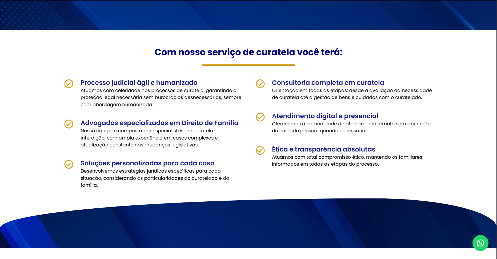

# ⚖️ João Vitor Advocacia - Curatela e Direito Previdênciario

## 💼 Sobre o Projeto

Aplicação web desenvolvida estrategicamente para o escritório **João Vitor Advocacia**, refletindo um compromisso sólido com:

- **Excelência Jurídica**: Plataforma moderna e confiável, voltada para o direito das famílias e proteção de pessoas vulneráveis  
- **Atendimento Humanizado**: Experiência digital intuitiva, com foco na confiança e acolhimento  
- **Transparência e Ética**: Clareza na apresentação dos serviços e princípios profissionais  

Este projeto foi cuidadosamente estruturado para:  
✔ Reforçar a autoridade no campo da curatela e direito civil  
✔ Facilitar o acesso de clientes aos serviços jurídicos  
✔ Apresentar conteúdos informativos e educativos sobre os direitos dos curatelados  

<div align="center">
  
  
  
</div>

---

## ✨ Diferenciais Estratégicos

| Característica           | Benefício                                      |
|--------------------------|------------------------------------------------|
| Design Profissional      | Transmite confiança e seriedade                |
| Conteúdo Jurídico Claro  | Facilita o entendimento de temas complexos     |
| Responsividade Total     | Acesso otimizado via celular ou computador     |
| SEO Jurídico             | Aumento da visibilidade nos mecanismos de busca|
| Canal de Contato Rápido  | Agilidade na comunicação com o escritório      |

> "Mais que um site, um ponto de apoio jurídico para quem mais precisa." — João Vitor, Advogado

---

## 🧠 Tecnologias Utilizadas

- React  
- TypeScript  
- Material UI  

---

## ✅ Requisitos para Rodar o Projeto

- [Visual Studio Code](https://code.visualstudio.com/)
- [Node.js](https://nodejs.org/en/)
- [Git](https://gitforwindows.org/)

### ⚙️ Instalação e Execução

```bash
# Clone o repositório
git clone https://github.com/kelvinteixeira/Landingpage-exemplo.git

# Acesse o diretório do projeto
cd landaingpage-exemplo

# Instale as dependências
yarn
# ou
npm install

# Inicie a aplicação
yarn dev
# ou
npm run dev

# Acesse no navegador:
http://localhost:5173/
